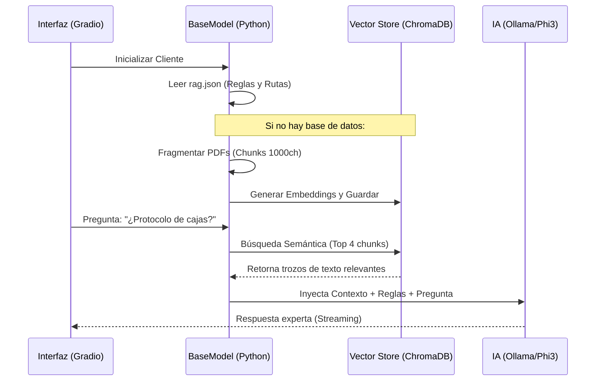

# Arquitectura LLM + RAG Vectorial Profesional

Bienvenido a la documentación del núcleo de IA del TFM. Este módulo ha evolucionado de un simple lector de documentos a un sistema de **Generación Aumentada por Recuperación (RAG) Profesional** basado en bases de datos vectoriales.

## 🎯 ¿Qué hace este módulo?

Este componente permite a la IA responder preguntas complejas basándose estrictamente en la documentación privada de un cliente (Bancos, Estudios Contables, etc.), evitando invenciones y garantizando precisión técnica.

**Las 3 innovaciones aplicadas:**
1.  **Fragmentación (Chunking):** Los documentos no se leen "de un tirón". Se dividen en trozos inteligentes de 1000 caracteres para asegurar que el LLM encuentre la aguja en el pajar.
2.  **Memoria Semántica (Embeddings):** Utilizamos modelos matemáticos para convertir el texto en vectores. Esto permite buscar por "significado" y no solo por palabras exactas.
3.  **Orquestación por Manifiesto:** Todo el comportamiento del modelo (quién es, qué reglas sigue) se define en un archivo `rag.json` sin tocar el código Python.

---

## 🏗️ Arquitectura de Archivos

El sistema separa la lógica del motor (Cerebro) de los datos del cliente (Cuerpo).

```text
📁 LLM/
 ├── base_llm.py             # Clase Madre: Motor RAG, Chunks y Vectores.
 └── clientes/               # Clientes específicos (Heredan de BaseModel)
      ├── banco.py           # Perfil del Auditor Bancario.
      └── estudio_contable.py # Perfil del Consultor Fiscal.

📁 RAG-docs/
 └── [cliente]/
      ├── config/            # rag.json (Manifiesto) y settings.json.
      ├── data/              # PDFs, Tablas y archivos crudos.
      └── db/                # Base de datos vectorial (ChromaDB).
```

---

## 🗺️ Diagrama de Flujo (RAG Vectorial)



---

## 🛠️ Requisitos y Configuración

### Dependencias (Gestión con UV)
Para que el sistema funcione, instalamos las librerías de procesamiento vectorial:
```powershell
uv add langchain-chroma langchain-huggingface pypdf
```

### El Manifiesto Inteligente (`rag.json`)
Cada cliente debe tener un archivo de configuración en su carpeta `config/`. Ejemplo:
```json
{
    "cliente": { "rol_llm_personalizado": "Auditor Senior" },
    "instrucciones_sistema": {
        "reglas_oro": ["Citar siempre fuente", "No inventar cifras"]
    },
    "indice_conocimiento": {
        "modulos": [
            { "nombre": "Legal", "directorio": "data/pdfs/legal/" }
        ]
    }
}
```

---

## 📖 Componentes Detallados

### 1. `base_llm.py` (La Clase Madre)
*   **`__init__`**: Carga automáticamente el manifiesto y el motor de embeddings.
*   **`configurar_conocimiento()`**: Detecta si ya existe una base de datos en la carpeta `db/`. Si no existe, lanza el proceso de ingesta.
*   **`_crear_vector_db()`**: El corazón del RAG. Usa `RecursiveCharacterTextSplitter` para crear trozos de texto con solapamiento (overlap) para no perder contexto.
*   **`responder()`**: Aquí ocurre la magia. Antes de responder, consulta a `ChromaDB`, recupera los 4 párrafos más importantes y se los entrega al LLM para que "estudie" antes de hablar.

### 2. Clases de Cliente (`banco.py`, etc.)
Son clases minimalistas. Su único trabajo es decirle a la Clase Madre dónde está su carpeta de documentos. Todo lo demás es automático.

---

## 🖥️ Interfaz del Usuario
Al usar **Gradio 6.x**, el sistema soporta respuestas en tiempo real (streaming). Cuando seleccionas un cliente, el motor carga su base de datos vectorial específica, permitiendo saltar entre clientes (Banco, Contable) manteniendo sus bases de conocimiento totalmente aisladas y seguras.