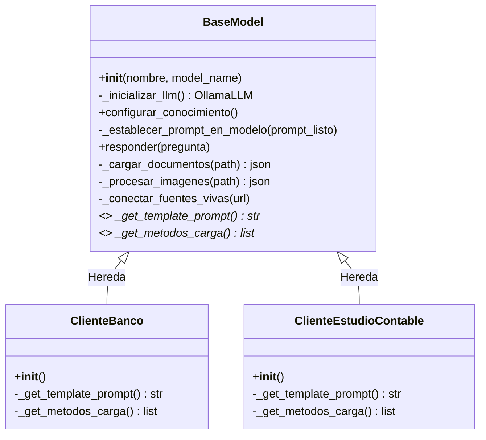
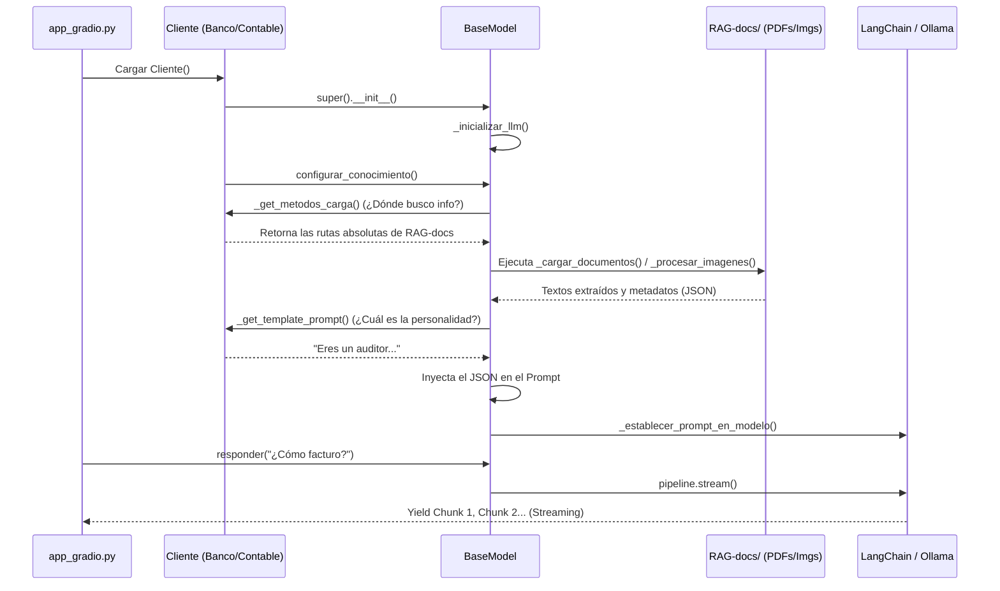

# Arquitectura LLM + RAG (Generación Aumentada por Recuperación)

Bienvenido a la documentación del módulo de Inteligencia Artificial (LLM) del TFM. Esta guía está diseñada para que cualquier persona, independientemente de su nivel técnico, pueda entender cómo funciona nuestro sistema conversacional inteligente de punta a punta.

## 🎯 ¿Qué hace este módulo?

Este módulo le da "cerebro" y "conocimiento" a nuestra aplicación. 
En lugar de tener un chatbot genérico que responde con información general (o que inventa respuestas, fenómeno conocido como alucinación), utilizamos una técnica de IA llamada **RAG** (Retrieval-Augmented Generation). 

**¿Cómo funciona de forma simple?**
1. **Separación por Clientes:** Trabajamos con múltiples configuraciones, por ejemplo, un "Banco" o un "Estudio Contable".
2. **Bases de Conocimiento:** Cada uno de estos clientes posee sus documentos propios y privados (leyes, manuales, normativas, organigramas en PDF y JPG).
3. **Inyección de Memoria Automática:** Al abrir un chat, el script busca todos esos documentos, extrae el texto usando Python, y se lo inyecta directamente al cerebro de la IA antes de que el usuario envíe su primer mensaje.
4. **Respuesta Experta:** El modelo adopta esa personalidad y responde las preguntas de los usuarios referenciando a las fuentes exactas (los documentos cargados).

---

## 🏗️ Arquitectura General

El código está construido usando **Programación Orientada a Objetos** aplicando el **Patrón Template Method** y **Herencia**. Se estructura mediante una **Clase Madre Base** que estandariza los procesos técnicos, y múltiples **Clases Hijas** que las heredan para personalizar al cliente.

**Árbol de Directorios:**
```text
📁 LLM/
 ├── base_llm.py                  <-- La Clase Madre (La lógica y abstracción)
 ├── clientes/                    <-- El "perfil" de cada cliente (Clases Hijas)
 │    ├── banco.py                <-- Define personalidad y rutas para el Banco
 │    └── estudio_contable.py     <-- Define personalidad y rutas para el Estudio
```

### Motor de Lenguaje y Tecnologías:
- Utilizamos **Ollama** de forma local, sirviendo como proxy el modelo **`phi3`**, un modelo de lenguaje con gran capacidad analítica y rápida ejecución.
- Utilizamos **LangChain**, una librería que nos facilita orquestar los Prompts y enviar la información de manera estructurada y segura.
- Utilizamos **pypdf** para la lectura y fragmentación de los archivos.

---

## 🗺️ Diagrama de Clases y Métodos

Para entender cómo se comunican los métodos desde el inicio del programa, aquí tienes un diagrama de flujo de toda la arquitectura:





---

## 📖 Componentes Detallados

A continuación se detalla a profundidad todo lo que sucede internamente en el código.

### 1. `base_llm.py` (La Clase Madre: `BaseModel`)

Esta es la "sala de máquinas" y está creada bajo importes abstractos (`ABC`). No se permite inicializarla directamente; cualquier cliente debe interactuar mediante sus herederas.

**Métodos de Configuración y Control:**
* **`__init__(self, nombre_cliente, model_name="phi3")`**: Constructor que guarda variables fundamentales, inicializa la lista interna de conocimiento y crea el LLM.
* **`_inicializar_llm(self)`**: Función protegida que conecta con el endpoint local de `Ollama` (`http://localhost:11434`). Su `temperature` está intencionalmente configurada a `0` para garantizar que la IA se ciña estrictamente al texto suministrado sin alucinar o buscar "creatividad" excesiva.
* **`configurar_conocimiento(self)`**: El cerebro de orquestación. Recorre todos los métodos de carga dictados por la clase hija (ver abajo), une los resultados recopilados en una lista de diccionarios que formatea como un `JSON Strings`, inyecta ese JSON en el placeholder exacto del `System Message` y le setea ese prompt al LLM.  
* **`_establecer_prompt_en_modelo(self, prompt_listo)`**: Recibe el texto de la instrucción ya armada y utiliza las clases de LangChain (`ChatPromptTemplate`, `SystemMessage`, `HumanMessagePromptTemplate`) para generar el canal estandarizado donde la IA recibirá nuestras preguntas a partir de ese momento.

**Métodos Abstractos (Decorados con `@abstractmethod`):**
Estos métodos fuerzan a los desarrolladores a implementarlos obligatoriamente si crean nuevos clientes:
* **`_get_template_prompt(self)`**: Otorga la "personalidad" de dicho chatbot e incluye un marcador `{JSON_CONTEXTO}`.
* **`_get_metodos_carga(self)`**: Devuelve qué métodos de ingesta específicos deben activarse.

**Métodos de Mapeo e Ingesta:**
* **`_cargar_documentos(self, path)`**: Método central del RAG analógico. Busca iterativamente un path completo mediante `os.walk`, rastreando todos lo que finalice en `.pdf`. Llama a de `PdfReader` y almacena texto crudo, limitándolo a un set de caracteres para evitar rebalsar la ventana de tokenización del LLM local.
* **`_procesar_imagenes(self, path)`**: Registra el contexto del mundo físico: enumera mediante extensiones controladas las imágenes de la carpeta y agrega a la bolsa de conocimiento del LLM una descripción de que dichas imágenes ("organigramas.jpg", por ejemplo) existen y pueden estar conectadas en la consulta.
* **`_conectar_fuentes_vivas(self)`**: Interfaz de preparación para habilitar el uso futuro de bases SQL u otro tipo de endpoints en vivo al vuelo.

---

### 2. Clases Hijas (`banco.py` y `estudio_contable.py`)

Su propósito es ser minúsculas y manejables. Son meramente configuradores por cliente. A las clases hijas "no les importa el CÓMO" se abren los PDFs o conectan a Ollama; solo definen el **QUIÉN SOY** y el **DÓNDE ESTÁ LO MÍO**.

#### A. Cliente Banco (`ClienteBanco`)
- **Archivos:** Calcula rutas dinámicas apoyándose en su propia variable interna `__file__` asegurándose de resolver SIEMPRE en `C:/repositorios_github/TFM/TFM/RAG-docs/client-banco`. 
- **Personalidad (`_get_template_prompt`):** Se sitúa firmemente en el rol de "Auditor Senior del Banco", obligándole a usar lenguaje muy profesional, buscar entre sus RAG-docs y evitar responder si no encuentra respuesta.
- **Flujo (`_get_metodos_carga`):** Solamente registra su carpeta general de `client-banco` para procesar documentos de texto en PDF.

#### B. Cliente Estudio Contable (`ClienteEstudioContable`)
- **Archivos:** Maneja un flujo un poco más complejo dividiendo en dos subcarpetas específicas: `pdfs` para conocimiento contable puro y `/imagenes` para conocimiento visual como organigramas. 
- **Personalidad (`_get_template_prompt`):** Asume el rol de consultor fiscal experto en el código civil y normativa contable. Se requiere estrictamente la cita a un documento en particular durante la charla. Utiliza el escape `{{JSON_CONTEXTO}}` para que los String dinámicos encajen en Python.
- **Flujo (`_get_metodos_carga`):** Registra tanto llamadas para lectura de documentos vía `pypdf`, como llamadas de reconocimiento visual.

---

## 🖥️ Interfaz del Usuario (`app_gradio.py`)

Para que un auditor humano pueda interactuar frente a un ordenador, el proyecto usa esta interfaz implementada con **Gradio 6.x**. El proceso es completamente responsivo:

1. El usuario se topa con un menú de opciones (Banco, Estudio Contable). 
2. Cuando oprime **"Cargar Cliente"**, hace instanciar dinámicamente nuestra clase hija deseada. En ese instante exacto ocurre toda la secuencia técnica: La clase pide todos los archivos de `RAG-docs`, se filtran los PDF, se transcriben mediante PyPDF, y esa inmensa cantidad de conocimiento se formatea en un JSON interno que se implanta a Ollama. Todo esto sucede en segundos y cambia la etiqueta de la web a "Cliente X Listo para operar". 
3. Cuando interactuamos a través de la caja inferior de chat, el Gradio utiliza la estructura de diccionarios en forma de MessageDict `{"role": "user", "content": ...}` (normativa exigida por Gradio v6+).
4. Nuestro `app_gradio` recibe del método `BaseModel.responder()` una retransmisión de bytes que él procesa internamente como una **Función Generadora ("Yield Streaming")**, dando por resultado unas respuestas suaves que van apareciendo letra por letra en la pantalla de Windows hasta culminar el concepto.