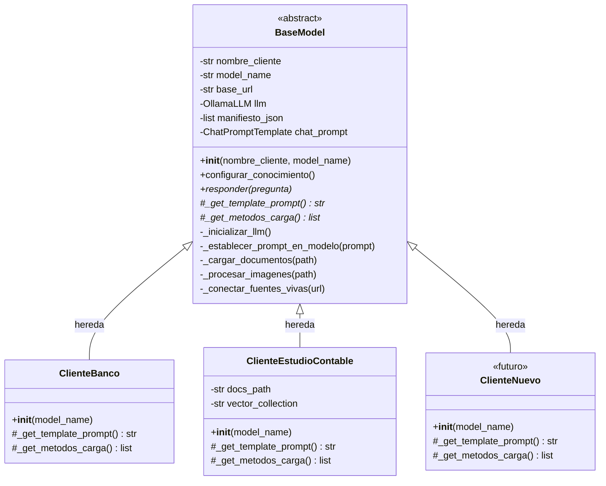

# 🧠 Módulo LLM — Arquitectura de Inteligencia

Este módulo gestiona la lógica de los Modelos de Lenguaje (LLM) y la implementación del sistema RAG (Retrieval-Augmented Generation) para múltiples clientes.

---

## 📂 Estructura de Archivos

```
LLM/
├── __init__.py               ← Registro del paquete Python
├── base_llm.py               ← Clase madre abstracta (BaseModel)
├── README.md                 ← Este archivo
├── prueba.ipynb              ← Notebook de pruebas
│
├── clientes/                 ← Clases hijas específicas por cliente
│   ├── __init__.py           ← Registro del subpaquete + imports de conveniencia
│   ├── banco.py              ← ClienteBanco (Banco X)
│   └── estudio_contable.py   ← ClienteEstudioContable (Estudio Contable)
│
├── ingestion/                ← Scripts de ingesta de datos
│   └── ingestor_basico.py    ← Verificación de acceso a carpetas del contenedor
│
├── evaluations/              ← Notebooks de evaluación de calidad
│   ├── eval_banco.ipynb
│   └── eval_estudio_contable.ipynb
│
├── prompts/                  ← Plantillas de prompts (próximamente)
└── governance/               ← Políticas de gobernanza del modelo (próximamente)
```

---

## 📦 ¿Qué hacen los `__init__.py`?

Los archivos `__init__.py` convierten una carpeta normal en un **paquete Python importable**. Sin ellos, Python no reconoce la carpeta como módulo y los `import` fallan.

| Archivo | Qué hace |
|---|---|
| `LLM/__init__.py` | Registra `LLM/` como paquete. Permite hacer `from LLM.base_llm import BaseModel` desde cualquier parte del proyecto. |
| `LLM/clientes/__init__.py` | Registra `clientes/` como subpaquete. Además, re-exporta las clases hijas para permitir imports directos como `from LLM.clientes import ClienteBanco`. |

**Ejemplo práctico:**
```python
# Sin __init__.py → ❌ ImportError
from LLM.clientes import ClienteBanco

# Con __init__.py → ✅ Funciona
from LLM.clientes import ClienteBanco
```

---

## 🏗️ Arquitectura de Clases

Se usa un patrón de **Herencia + Métodos Abstractos (ABC)** para garantizar que cada cliente siga el mismo contrato:

1. **`BaseModel` (Clase Madre - Abstracta):** Define la infraestructura común (conexión Ollama, orquestación de conocimiento, método `responder()`). No se puede instanciar directamente.
2. **Clases Hijas (en `/clientes`):** Heredan de `BaseModel` y **deben** implementar dos métodos abstractos: `_get_template_prompt()` y `_get_metodos_carga()`.

---

## 🔧 Métodos de `BaseModel` (`base_llm.py`)

### Métodos públicos
| Método | Descripción |
|---|---|
| `__init__(nombre_cliente, model_name)` | Inicializa atributos base y conecta con Ollama. |
| `configurar_conocimiento()` | Orquesta todo: ejecuta las ingestas, genera el JSON y configura el prompt en el modelo. |
| `responder(pregunta)` | Responde en streaming a una pregunta usando el conocimiento cargado. |

### Métodos abstractos (las hijas DEBEN implementar)
| Método | Descripción |
|---|---|
| `_get_template_prompt() → str` | Retorna el system prompt con `{JSON_CONTEXTO}` como placeholder para inyectar el conocimiento. |
| `_get_metodos_carga() → list` | Retorna la lista de funciones de carga de datos (documentos, imágenes, APIs, etc.). |

### Métodos internos
| Método | Descripción |
|---|---|
| `_inicializar_llm()` | Crea la conexión con Ollama usando las variables de entorno. |
| `_establecer_prompt_en_modelo(prompt)` | Configura el `ChatPromptTemplate` con el system prompt ya armado. Usa `SystemMessage` (no template) para evitar conflictos con las `{}` del JSON. |

### Métodos de ingesta (sobreescribibles)
| Método | Descripción |
|---|---|
| `_cargar_documentos(path)` | Base para cargar documentos. Las hijas sobreescriben con lógica real. |
| `_procesar_imagenes(path)` | Base para procesar imágenes/organigramas. Las hijas sobreescriben. |
| `_conectar_fuentes_vivas(url)` | Base para conectar APIs o DBs en vivo. Las hijas sobreescriben. |

---

## 🔧 Métodos de las Clases Hijas

### `ClienteBanco` (`clientes/banco.py`)
| Método | Descripción |
|---|---|
| `__init__(model_name)` | Inicializa con nombre "Banco X" y ejecuta `configurar_conocimiento()`. |
| `_get_template_prompt()` | Retorna prompt de "Auditor Senior del Banco X". |
| `_get_metodos_carga()` | Carga documentos legales + organigramas del banco. |

### `ClienteEstudioContable` (`clientes/estudio_contable.py`)
| Método | Descripción |
|---|---|
| `__init__(model_name)` | Inicializa con nombre "Estudio Contable", configura rutas de docs y colección de vectores. |
| `_get_template_prompt()` | Retorna prompt de "experto en normativa fiscal". |
| `_get_metodos_carga()` | Carga documentos desde `./RAG-docs/02_Silver/Contable`. |

---

## 📄 Archivo de Ingesta (`ingestion/ingestor_basico.py`)

| Función | Descripción |
|---|---|
| `check_folders()` | Verifica que las carpetas clave del contenedor Docker (`/app/RAG-docs`, `/app/database`, `/app/LLM/ingestion`) existen y son accesibles. |

---

## 🚀 Cómo usar

```python
from LLM.clientes import ClienteBanco

bot = ClienteBanco()
for chunk in bot.responder("¿Cuál es el protocolo de seguridad?"):
    print(chunk, end="")
```

---

## ➕ Cómo crear un nuevo cliente

1. Crea un archivo en `clientes/` (ej: `aseguradora.py`).
2. Hereda de `BaseModel` e implementa los dos métodos abstractos:
```python
from ..base_llm import BaseModel

class ClienteAseguradora(BaseModel):
    def __init__(self, model_name="phi3"):
        super().__init__(nombre_cliente="Aseguradora Y", model_name=model_name)
        self.configurar_conocimiento()

    def _get_template_prompt(self) -> str:
        return """Tu prompt personalizado con {JSON_CONTEXTO} como placeholder."""

    def _get_metodos_carga(self) -> list:
        return [lambda: self._cargar_documentos(path="./docs/aseguradora")]
```
3. Agrégalo al `clientes/__init__.py`:
```python
from .aseguradora import ClienteAseguradora
```

---

## 🗺️ Mapa de Clases

