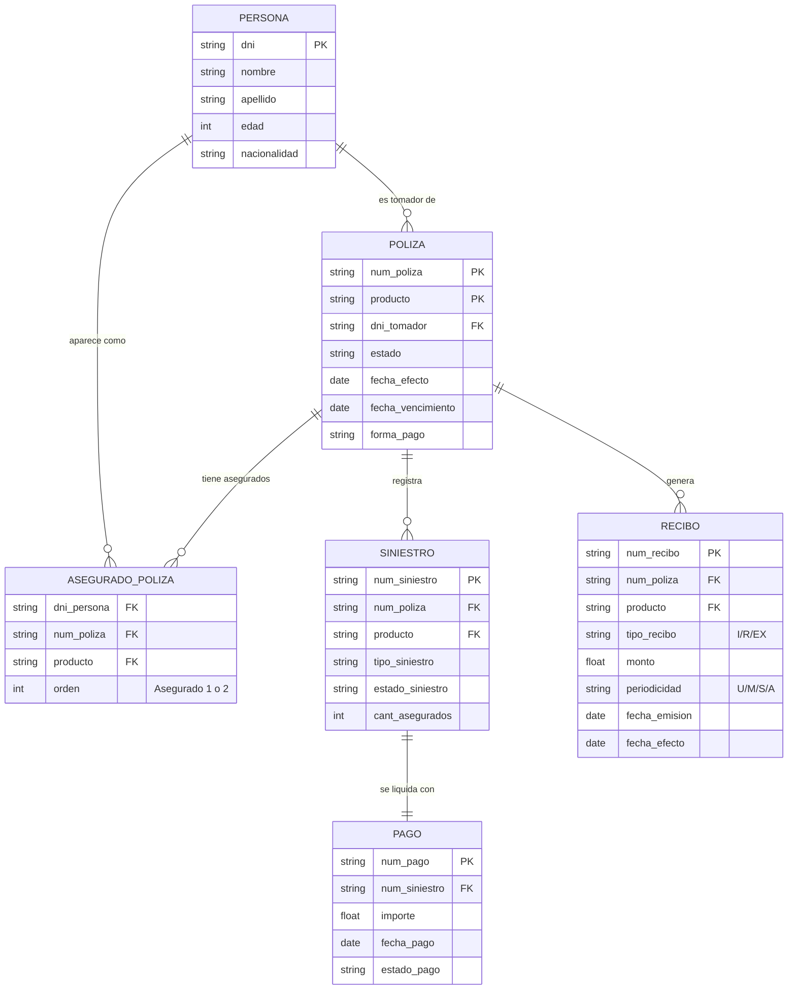

# Documentación Técnica: Modelo de Datos Seguros

Este modelo representa la arquitectura relacional para el área de seguros. Está diseñado para ser interpretado por modelos de lenguaje (LLMs) y generar consultas SQL precisas.

## 1. Diagrama de Entidad-Relación (Mermaid)

## 2. Guía de Cruces (Lógica de Negocio)

Para garantizar la integridad de los datos en las consultas, se deben seguir estas reglas de unión:

| Desde Tabla | Hacia Tabla | Columnas de Cruce (JOIN ON) | Tipo de Relación |
| :--- | :--- | :--- | :--- |
| **POLIZA** | **PERSONA** | `POLIZA.dni_tomador = PERSONA.dni` | 1:N (Tomador) |
| **POLIZA** | **ASEGURADO_POLIZA** | `POLIZA.num_poliza = ASEGURADO_POLIZA.num_poliza` AND `POLIZA.producto = ASEGURADO_POLIZA.producto` | 1:N (Asegurados) |
| **POLIZA** | **SINIESTRO** | `POLIZA.num_poliza = SINIESTRO.num_poliza` AND `POLIZA.producto = SINIESTRO.producto` | 1:N |
| **POLIZA** | **RECIBO** | `POLIZA.num_poliza = RECIBO.num_poliza` AND `POLIZA.producto = RECIBO.producto` | 1:N |
| **SINIESTRO** | **PAGO** | `SINIESTRO.num_siniestro = PAGO.num_siniestro` | 1:1 |
| **ASEGURADO_POLIZA** | **PERSONA** | `ASEGURADO_POLIZA.dni_persona = PERSONA.dni` | N:1 |

> **Nota Crítica:** En todas las tablas que dependen de la póliza (Siniestros, Recibos, Asegurados), el cruce **DEBE** incluir tanto `num_poliza` como `producto` para evitar duplicidad de registros.