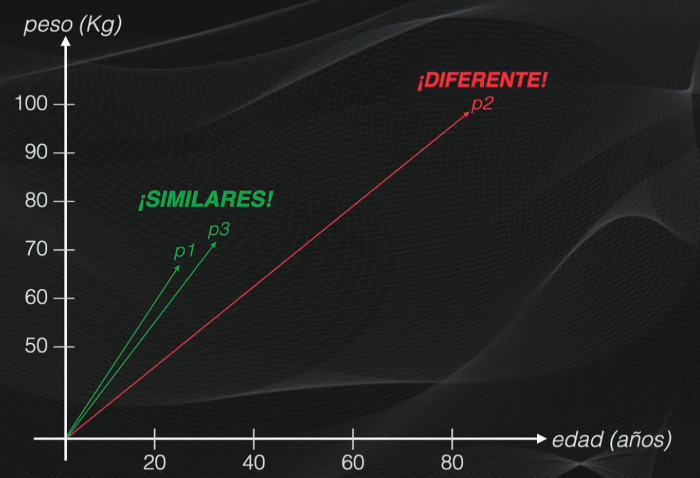

# Análisis Técnico: `embedding_test.py`

PONER ACA QUE ESL O QUE QUEREMOS

# 0. Cosine Similarity

Tenemos 3 casos a comparar:

Persona A: 32 años, 71.3 kg
Persona B: 82 años, 95.3 kg
Persona C: 25 años, 68.2 kg

Queremos saber cuál es más similar a un vector de referencia (por ejemplo, p1)

Aca tengo 3 vectores de 2 dimensiones: edad y peso.

````md
`p1 = [25, 68.2]`
`p2 = [82, 95.3]`
`p3 = [32, 71.3]`
````

Si los graficamos:



**¿Como sabemos matematicamente que son similares?**

## ¿Como medimos las similitudes? 

La similitud del coseno NO compara el tamaño del vector.

Compara la **dirección**.

Dos vectores son similares si apuntan hacia el mismo lugar.

$$
\cos(\theta)=\frac{A \cdot B}{|A||B|}
$$

### 0.1 Producto punto

El producto punto multiplica cada componente y luego suma.

$$
{sumatoria A \cdot B}
$$

En este caso, seria hacer lo siguiente:

$$
 P_1.edad\cdot P_2.edad + P_1.peso\cdot P_2.peso
$$


Esto mide cuánto “apuntan” en la misma dirección.

* Valor grande → muy similares
* Valor pequeño → poco similares

---

### 0.2. Magnitud (`|A| * |B|`)

La magnitud es el tamaño del vector.

$$
\sqrt{P_1.edad^2+P_1.peso^2} \cdot \sqrt{P_2.edad^2+P_2.peso^2}

$$

Esto sirve para normalizar el resultado y evitar que el tamaño afecte la comparación.

---

### 0.3. Aplicacion final

Ahora vamos a aplicarlo a cada uno de nuestros ejemplos:

````md
`p1 = [25, 68.2]`
`p2 = [82, 95.3]`
`p3 = [32, 71.3]`
````


#### `p1` vs `p2`

| Paso           | Cálculo                               | Resultado |
| -------------- | ------------------------------------- | --------- |
| Producto punto | $(25 \times 82) + (68.2 \times 95.3)$ | $8548.46$ |
| Magnitud `p1`  | $\sqrt{25^2 + 68.2^2}$                | $72.64$   |
| Magnitud `p2`  | $\sqrt{82^2 + 95.3^2}$                | $125.72$  |
| Coseno         | $\frac{8548.46}{72.64 \times 125.72}$ | $0.936$   |


#### `p1` vs `p3`

| Paso           | Cálculo                               | Resultado |
| -------------- | ------------------------------------- | --------- |
| Producto punto | $(25 \times 32) + (68.2 \times 71.3)$ | $5662.66$ |
| Magnitud `p1`  | $\sqrt{25^2 + 68.2^2}$                | $72.64$   |
| Magnitud `p3`  | $\sqrt{32^2 + 71.3^2}$                | $78.15$   |
| Coseno         | $\frac{5662.66}{72.64 \times 78.15}$  | $0.997$   |


#### `p2` vs `p3`

| Paso           | Cálculo                               | Resultado |
| -------------- | ------------------------------------- | --------- |
| Producto punto | $(82 \times 32) + (95.3 \times 71.3)$ | $9418.89$ |
| Magnitud `p2`  | $\sqrt{82^2 + 95.3^2}$                | $125.72$  |
| Magnitud `p3`  | $\sqrt{32^2 + 71.3^2}$                | $78.15$   |
| Coseno         | $\frac{9418.89}{125.72 \times 78.15}$ | $0.959$   |


<br>
<hr>
<br>


# 1. Parámetros Globales (Constantes)
* **`CHUNK_SIZES` y `OVERLAPS`**: Listas de tamaños y solapamientos que se probarán de forma combinada (Ej: Chunk 500 con overlap 50, luego 500 con 150, etc.).
* **`MODELS`**: Los modelos open-source de HuggingFace que se van a evaluar.
* **`TOP_K = 3`**: Indica que las métricas de evaluación revisarán, como máximo, los primeros 3 resultados devueltos por el motor de búsqueda semántica.

### 2. Funciones de Utilidad
* **`cosine_similarity(a, b)`**: Esta función calcula la **Similitud del Coseno** ya.
* **`load_documents(directory)`**: Usa LangChain para leer todos los PDFs y concatena todo su texto.
* **`get_word_counts(chunks)`**: Calcula estadísticas simples de número mínimo, máximo y promedio de palabras de los fragmentos.
* **`generate_test_queries(text, num_queries=10)`**: Genera el **"Ground Truth"** separando el PDF por puntos, filtrando oraciones cortas y eligiendo 10 al azar para probar y evaluar.

---

# 3. Clases de Evaluación


## 3.1. Clase: Medición Actual (MRR)

La métrica **Mean Reciprocal Rank (MRR)** evalúa qué tan arriba aparece el resultado correcto dentro de un ranking generado por el modelo de embeddings.

Su objetivo es medir si el sistema devuelve rápidamente el fragmento más relevante.


**Fórmula** para 

$$
MRR = \frac{1}{N} \sum_{i=1}^{N} \frac{1}{rank_i}
$$


Donde:

- $N$ = cantidad total de consultas
- $rank_i$ = posición donde apareció el resultado correcto
* **$\frac{1}{rank}$** → mide **una sola consulta**
* **$\sum$** → junta los resultados de **todas las consultas**
* **$\frac{1}{N}$** → lo convierte en un **promedio del modelo**

**Interpretación**

El MRR utiliza la fórmula para una **unica** consulta:

$$
\frac{1}{posición}
$$

Esto significa que mientras más arriba aparezca el resultado correcto, mayor será el puntaje.

| Posición correcta | Cálculo | Valor |
|---|---|---|
| 1 | $\frac{1}{1}$ | $1.0$ |
| 2 | $\frac{1}{2}$ | $0.5$ |
| 3 | $\frac{1}{3}$ | $0.33$ |
| 10 | $\frac{1}{10}$ | $0.1$ |

Por ejemplo:

- Si el fragmento correcto aparece primero, el modelo obtiene el máximo puntaje posible (`1.0`).
- Si aparece en segunda posición, el puntaje baja a `0.5`.
- Si aparece muy abajo en el ranking, el valor se acerca a `0`.

Esto permite penalizar modelos que obligan al usuario a revisar muchos resultados antes de encontrar la respuesta correcta.


**Ordenamiento del ranking**

```python
ranked_indices = np.argsort(similarities)[::-1] # de mayor a menor
```
* `np.argsort()` ordena los índices de menor a mayor.

* El `[::-1]` invierte el orden para dejar primero los fragmentos más similares.


**Búsqueda del resultado correcto**

```python
rank = np.where(ranked_indices == correct_idx)[0][0] + 1
```

* Se localiza en qué posición quedó el fragmento correcto dentro del ranking.
* Se suma `+1` porque Python indexa desde `0`.

---

## 4. Cálculo del Reciprocal Rank

```python
mrr_score += 1.0 / rank
```

Se calcula:

$$
\frac{1}{posición}
$$

Ejemplo:

* Posición 1 → `1.0`
* Posición 2 → `0.5`
* Posición 5 → `0.2`

---

## 5. Promedio final

```python
return mrr_score / len(correct_indices)
```

Se promedian todos los valores obtenidos entre las consultas evaluadas.

---

# Conclusión

El MRR mide qué tan rápido el usuario encuentra el resultado correcto.

* Un valor cercano a `1` indica que el modelo posiciona correctamente los documentos relevantes en los primeros lugares.
* Un valor bajo indica que el usuario necesita revisar múltiples resultados antes de encontrar la información correcta.

```
```


### 3.1. Clase: Medición Actual (MRR)
Evalúa el **Mean Reciprocal Rank (MRR)**.
* ¿Qué hace?: Toma los resultados ordenados por similitud y busca en qué posición quedó el fragmento correcto.
* Si el correcto está en posición 1, suma `1/1` (1.0). Si está en posición 2, suma `1/2` (0.5), en la 3 suma `1/3` (0.33), etc. Promedia este valor entre todas las consultas. 
* **En resumen:** Tu código mide la eficacia del "Top 1". Si tu MRR es cercano a 1, tu modelo es un francotirador; si es cercano a 0, el usuario tiene que hacer mucho scroll para encontrar la verdad.

### 3.2. Clase: Chunk Accuracy
Evalúa la precisión posicional absoluta y top-K.
* **`Acc_Top_1`**: Verifica si `ranked_indices[0] == correct_idx` (si el resultado número 1 es exactamente el chunk de donde salió la frase). Esto equivale a la Precisión máxima (1.0) para esa pregunta.
* **`Acc_Top_K`**: Verifica si el chunk correcto aparece en los `k` (ej. 3) primeros lugares. Esto representa la métrica de **Recall**.

### 3.3. Clase: LLM as a Judge
Usa Inteligencia Artificial Generativa (`gemini-1.5-flash`) para evaluar semánticamente.
* ¿Por qué?: A veces un modelo recupera un fragmento de texto diferente al original, pero que **sí contiene la respuesta** o información válida. Las métricas matemáticas lo darían como error.
* El LLM lee la consulta y el fragmento principal recuperado, y responde estrictamente con "SÍ" o "NO" dependiendo de si el texto responde a la pregunta.

---

# Flujo de ejecución

## 4. Configuración y Ejecución del Pipeline
Función orquestadora (`main()`). Inicia el pipeline, carga los modelos de HuggingFace en memoria e inicializa sus respectivos Tokenizers.

## 7. Preparación del Conjunto de Datos (Ground Truth)
Lee todo el texto de los PDFs con `load_documents` y manda a generar las 10 consultas de prueba.

## 8. Generación y Evaluación de Embeddings
Aquí ocurre el bucle principal de evaluaciones:
* **8.1 Bucle para cada configuración**: Itera combinando cada modelo, tamaño de chunk y overlap.
* **8.2 Chunking**: Corta el texto a evaluar usando `RecursiveCharacterTextSplitter`.
* **8.3 Contando Tokens y RAM**: Utiliza el AutoTokenizer para extraer la cuenta real de tokens, y verifica el consumo de memoria del sistema con `psutil`.
* **8.4 Generando Embeddings**: Convierte matemáticamente los chunks y las preguntas a vectores.
* **8.5 Encontrar Índices Correctos**: Averigua la posición ideal del chunk para validar luego con las métricas.
* **8.6 Cálculo Matriz Similitud**: Llama a `cosine_similarity` para enfrentar todas las preguntas contra todos los chunks generados.
* **8.7 Extraer Top 1 Chunks**: Saca el texto del chunk ganador absoluto de cada pregunta para poder pasárselo al LLM de Gemini.
* **8.8 Ejecución de Evaluadores**: Evalúa todo cruzando con MRR, Accuracy y el LLM Judge.

## 9. Guardado de Resultados
Toda la lista de resultados almacenados se convierte en un formato de tabla con Pandas (`df_results`). Se imprime un resumen rápido por terminal usando `tabulate` y finalmente se crea/sobrescribe el archivo `embedding_comparison_results.xlsx`.
